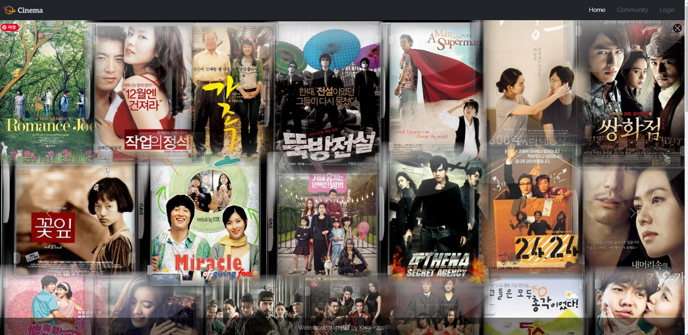
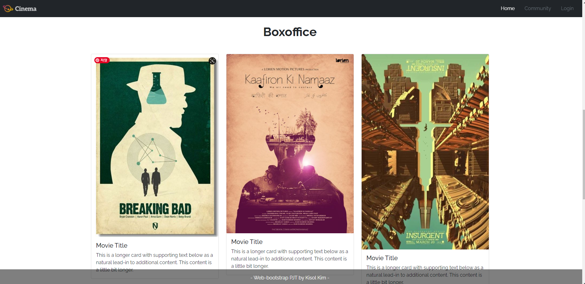
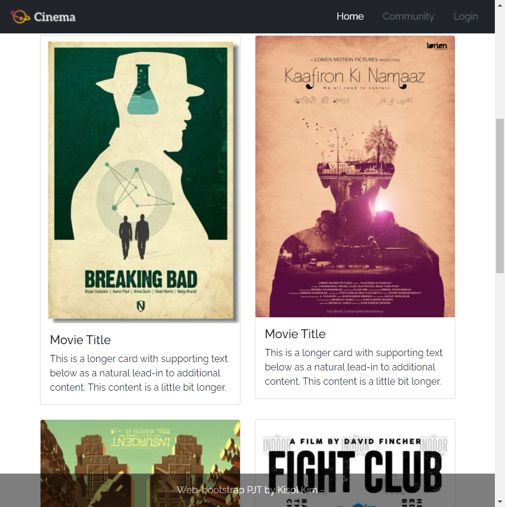
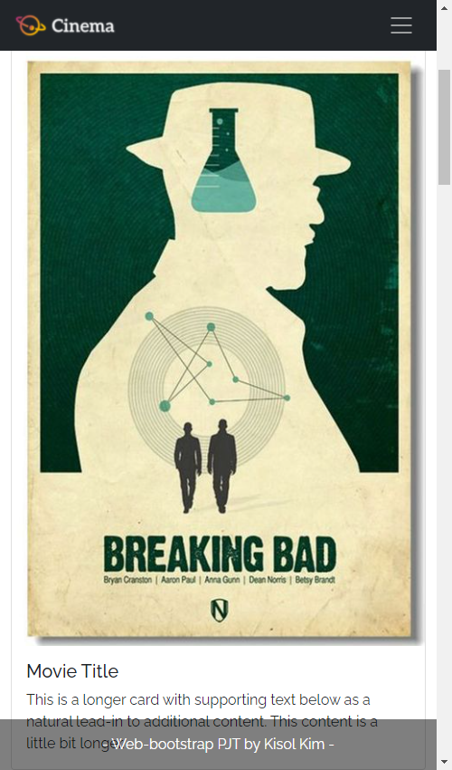
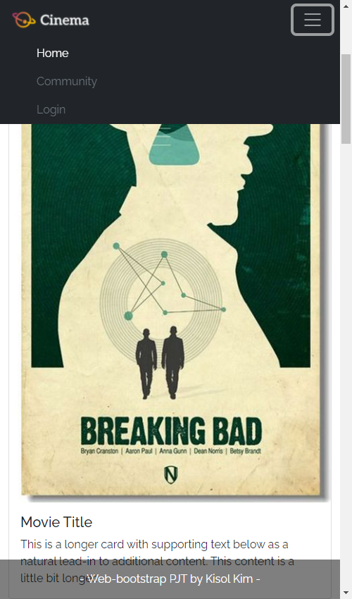
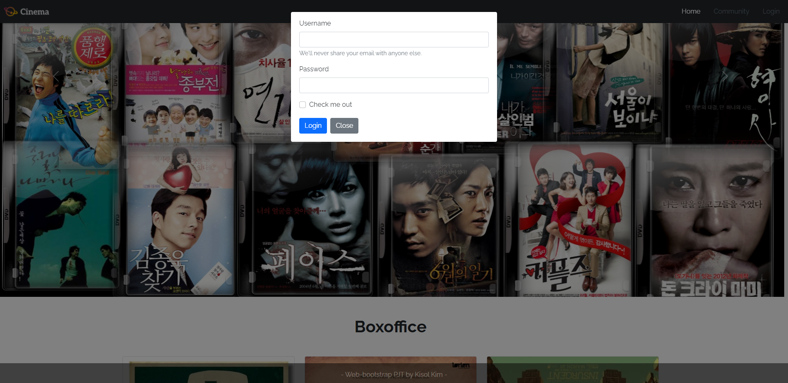
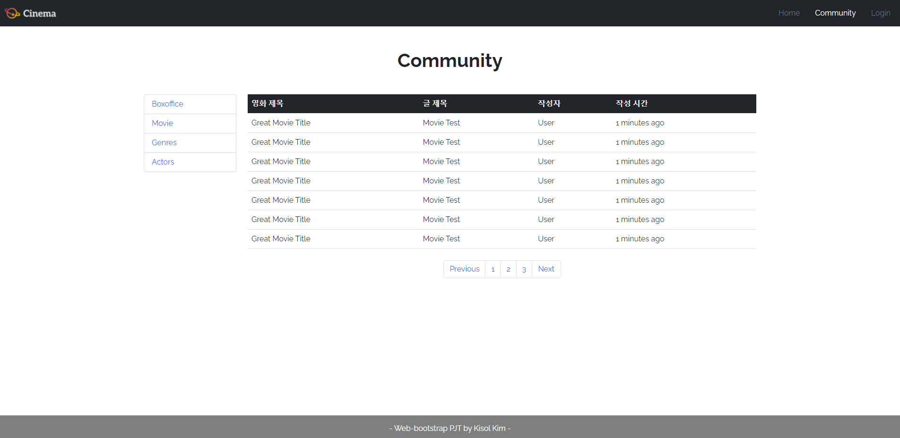

# pjt03 README


## 1. Description

 본 프로젝트는 영화 커뮤니티 서비스 개발을 위한 프론트 화면 구현하는 목적을 갖습니다.


## 2. Environment

- Windows OS 활용
- Bootstrap v5
- Google Chrome Browser
- Python 3.9.6 활용


## 3. Prerequisite

- 영화 기본 이미지


## 4. Explanation

### A. 01_nav_footer

- **문제 목적**

  - 핵심 : 반응형으로 웹 페이지의 기본 구성 요소인 네비케이션 바와 푸터 구현
  - 세부 : Viewport 크기에 따라 상단에 고정되어 있는 가로형 Navbar와 세로형 Navbar 구현, 하단에 고정되어 있는 푸터 구현 

- 주요 어려움

  1. Viewport 크기에 따른 Navbar 햄버거 버튼과 메뉴바 리스트 나타내기

     - 어려웠던 점 : 이미 구현돼 있는 Navbar 기능의 하나하나 파악하지 못해 중간 지점에서 메뉴바 리스트가 사라졌었음

     - 해결 방법 : 하나하나 코드를 뜯어보고 Bootstrap 사이트를 읽어보며 expand의 기능에 대해 알게됨. expand 적용 포인트를 md로 변경.

       ```html
       <nav class="navbar navbar-expand-md navbar-dark fixed-top p-0">
       ```

  2. Viewport 크기에 따른 메뉴바 형태 다르게 나타내기 (768px 미만 : 세로형, 768px 이상 : 가로형)

     - 어려웠던 점 : 이미 구현돼 있는 Navbar 기능의 하나하나 파악하지 못해 중간 지점에서 메뉴바 리스트가 사라졌었음

     - 해결 방법 : 기본 방향을 column 형태로 셋팅하고 md 포인트부터 row 방향으로 변경 

       ```html
       <div class="navbar-nav ms-auto">
           <ul class="d-flex flex-column flex-md-row justify-content-between m-0">
               <li class="mx-2"><a class="text-white nav-link active" aria-current="page" href="02_home.html">Home</a></li>
               <li class="mx-2"><a class="text-secondary nav-link " href="03_community.html">Community</a></li>
               <li class="mx-2"><a class="text-secondary nav-link" href="#" data-bs-toggle="modal" data-bs-target="#exampleModal">Login</a></li>
           </ul>
       </div>
       ```

### B. 02_home











- **문제 목적**

  - 핵심 : Carousel 구현과  반응형으로 Grid Card 수 다르게 구현
  - 세부 : Carousel을 통해 메인 사진 구현, Grid Card에 영화 정보를 담아서 크기별로 행당 Card 수 변경
  
- 주요 어려움

  1. 반응형으로 Grid Card 개수 변할 수 있도록 구현

     - 어려웠던 점 : container, row, col을 어떤 태그에 설정해야될 지 어려움을 겪음

     - 해결 방법 : 제일 최상위 태그부터 차근차근 묶어가며 구현된 사이트를 보며 계속 시도

       ```html
         <section class="container">
           <div class="row row-cols-1 row-cols-sm-2 row-cols-lg-3 g-4">
             <article class="col">
               <div class="card">
                 
                 <div class="card-body">
                   <h5 class="card-title">Movie Title</h5>
                   <p class="card-text">This is a longer card with supporting text below as a natural lead-in to additional content. This content is a little bit longer.</p>
                 </div>
               </div>
             </article>
       ```

### C. 03_community



- **문제 목적**

  - 핵심 : 여러 요소들을 묶어 원하는 구성의 게시판 구현
  - 세부 : Grid System과 Flexbox를 활용하여 각 요소들 배치 

- 주요 어려움

  1. 게시판 목록과 게시판을 한 행에 배치

     - 어려웠던 점 : 코드가 너무 길어서 어느 요소가 상위 요소인지 파악하기가 어려웠고, 계속 게시판 요소가 다음행에 배치되어 있었음. 

     - 해결 방법 : 큰 그림을 그려보며 어떤 요소가 들어와야 할지 파악하며 container, row, col을 설정.

       ```html
       <div class="main container">
           <div class="row">
               <h1 class="text-center my-5 fw-bold">Community</h1>
               <!-- Sidebar -->
               <aside class="col-lg-2">
                   <ul class="list-group p-0 m-0">
                       <li class="list-group-item"><a class="text-decoration-none text-primary" href="#">Boxoffice</a></li>
                       <li class="list-group-item"><a class="text-decoration-none text-primary" href="#">Movie</a></li>
                       <li class="list-group-item"><a class="text-decoration-none text-primary" href="#">Genres</a></li>
                       <li class="list-group-item"><a class="text-decoration-none text-primary" href="#">Actors</a></li>
                   </ul>
               </aside>
       
               <!-- Board -->
               <section class="col-lg-10">
       ```

  2. Viewport 크기별로 게시판과 Pagination을 배치 

     - 어려웠던 점 : 테이블 게시판에서는 pagination이 테이블 크기에 맞춰서 구현해야 했음. 크기에 따른 화면 자체가 바뀌는걸 구현하는게 어려웠음.

     - 해결 방법 : 기존 수업때 말씀하신 d-none과 관련된 개념을 찾아본 후 적용. pagination의 경우, 테이블, 문자형 게시판 각각 하나씩 만들어 묶음.

       ```html
       <!--테이블 게시판-->
       <section class="col-lg-10">
         <div class="d-flex d-lg-flex flex-column align-items-center p-0 m-0 d-none">
           <table class="table mb-4">
             <thead class="table-dark">
                 
       <!--문자형 게시판-->             
       <div class="d-flex flex-column align-items-center d-lg-none">
         <article class="my-5 w-100">
           <hr>
             <div class="d-flex justify-content-between">
       ```

## 5. After Project

### 😊 What I Learned

- Bootstrap 활용 방법
- Grid System, Flexbox 사용 방법
- 반응형 웹에 대한 이해도 상승
- 그 외 구글 폰트 사용 방법

### 😂 What to Learn

- Grid Sytem, Flexbox의 정확한 개념에 대해 이해할 필요성을 느낌
- Bootstrap 내 요소들을 가져다 쓸 때 그냥 다 붙여넣는게 아니라 하나하나가 무슨의미인지 배울 필요성을 느낌
- 구글 폰트 외에도 icon, pavicon 등 사용해보기